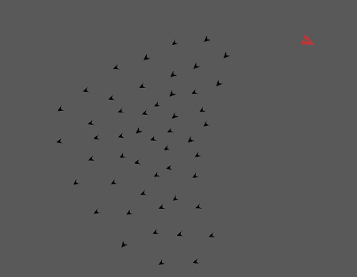

# Hunt
A simple game designed to train reinforcement learning agents. The server
exports endpoint for a actor to join the game. The input to this
endpoint is actors TCP address on which they listen to game updates.

An actor can send payload to another endpoint with updates to their direction
vectors.

The server re-calculates the position of entities based on its frame rate. With
each frame it sends new state to all players. The new state means a list of
velocity vectors of all entities in the game with their label.

Built with [bevy]. Bevy uses LLD linker to speed up the linking process.
[See][bevy-setup] the project installation information to find out more. If you
don't wish to use the LLD linker you might need to delete or rename the
`.cargo/config` file.

You will need the nightly compiler. You can override it on per project basis
so that your other projects aren't impacted:

```
$ rustup override set nightly
```



<!-- Invisible List of References -->
[bevy]: https://github.com/bevyengine/bevy
[bevy-setup]: https://bevyengine.org/learn/book/getting-started/setup/
